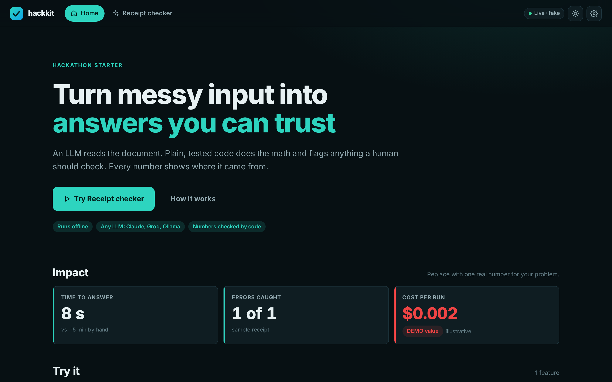
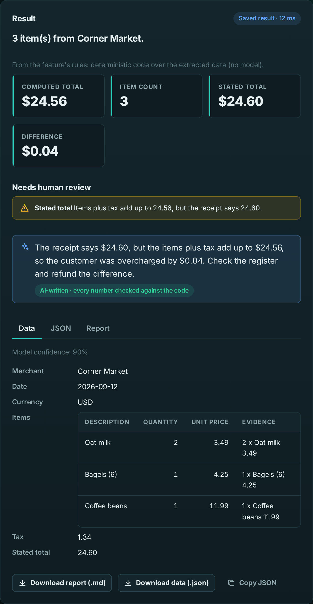

# hackkit

A hackathon template built to **win**, not just to run. The plumbing is done before the event, so
event time goes to the four things judges score: **the problem, a demo with no mistakes, AI they can
see, and a pitch that lands.**



| You get | So that |
|---|---|
| FastAPI + a plain HTML/CSS/JS UI kit (dark/light, maps, charts, no build step) | the demo looks like a product in hour one, and any agent can edit it |
| LLM extraction with schema validation, retry, cache and offline demo mode | the model reads messy input; the demo never dies on stage |
| `narrate` and `ask`: AI that explains and answers, with **every number checked by code** | judges SEE the AI, and never a wrong number |
| Provenance badges, golden tests, evals | "where does this number come from?" has an answer on screen |
| `make shots`, `make deck`, `make demo-video`, `make pages`, Devpost template | slides, video and a "Try it" link come from the real app in minutes |
| `make verify`, a pre-commit guard, `make freeze`, `make doctor`, milestones in `make lanes` | four people and two AI agents ship in parallel without breaking `main` |

## 60-second start

```bash
make setup && source .venv/bin/activate   # venv, install, pre-commit guard; copies .env.example to .env
make demo                                 # http://localhost:8000 — fake LLM, no key, no network
make test && make lint                    # Python + JS tests, ruff
```

Real model: set `LLM_PROVIDER=anthropic` (+ `ANTHROPIC_API_KEY`) or `groq` (+ `GROQ_API_KEY`) or
`ollama` in `.env`, then `make run`. Pitch tools: `pip install -e ".[pitch]" && playwright install chromium`.

## Event day in ten commands

The full runbook (Vietnamese) is [docs/DAY_OF.md](docs/DAY_OF.md). The spine:

```bash
gh repo create <name> --template Nguyen-Le-Tuan/hackkit --private --clone && cd <name> && make setup
./scripts/orchestrate.sh --now --transcript docs/<problem>.txt --document   # agents brief + plan the challenges
make init-project NAME="My App" TAGLINE="One line" TEAM="Team · names"      # your name everywhere, product README
make feature NAME=my_feature TITLE="My feature" PAGE=1                      # feature + test + eval + page
make lanes                                    # who does what, what runs in parallel, which milestone is late
make verify PR=12                             # merge only on "VERDICT: MERGE OK"
make snapshot && make pages                   # offline copy + public "Try it" site
make freeze                                   # 1h30 before the deadline: bug fixes only
make pitch                                    # screenshots -> slides (PPTX + PDF) -> captioned demo video
make doctor                                   # on the demo laptop, plus http://localhost:8000/#/doctor
```

## How it works

```
messy input (text, image, PDF)            question in plain English          computed result
        │                                          │                                │
  extract: LLM -> Pydantic schema         ask: LLM -> validated filter       narrate: LLM writes words
  (validation retry, cache, demo mode)    apply_query: code runs it          code checks every number
        │                                          │                                │
  rules(): deterministic Python  ──►  metrics + review flags + sources  ──►  FastAPI /api  ──►  web/ UI
                                                                                     └──► make snapshot -> static site
```

**The LLM reads and writes words; Python decides every number.** Uncertainty is shown (review flags,
confidence, sources), never hidden.

## Add a feature

```bash
make feature NAME=intake_triage TITLE="Intake triage" PAGE=1
```

1. Edit the schema in `src/features/intake_triage/__init__.py` (a `description=` on every field).
2. Write `INSTRUCTIONS` (what to extract) and `rules()` (the deterministic logic) with tests.
3. Paste a realistic `sample_text` and `sample_response`. The feature appears at
   `#/feature/intake_triage` with input, file drop, results, flags, an Explain button and downloads.

`src/features/receipt/` is the reference: the model lists the items, code adds them up, flags the
4-cent mismatch, and the Explain button writes a sentence whose numbers are all verified.

## AI judges can see, numbers they can trust

```python
from hackkit.narrate import narrate  # the AI explains; invented numbers are rejected

text = narrate(
    client,
    {"savings_usd": 235406, "payback_years": 10.8},
    instructions="Explain to the building owner why this upgrade pays off.",
).text

from hackkit.ask import Query, ask, apply_query  # plain-English question -> filter -> code

q = ask(client, "offices in Allentown saving over $50k", BuildingQuery).data
rows, understood = apply_query(buildings, q), q.explain()

from hackkit.provenance import sourced, DEMO  # every value carries its source

floors, cost = sourced(11, "OpenStreetMap", 0.9), sourced(8.0, DEMO)  # demo -> red in the UI

from hackkit.golden import assert_close  # the partner's worked example as a test

assert_close(result.model_dump(), {"kwh": 9047.6, "savings": 1447.6}, rel=1e-3)
```



## Pitch kit

`docs/pitch/README.md` has the timeline, the rubric map and the checklists. Everything is text you
edit and a command that rebuilds it from the running app:

| Command | From | To |
|---|---|---|
| `make shots` | `docs/pitch/shots.toml` | `docs/pitch/shots/*.png` (fails on any browser error) |
| `make deck` | `docs/pitch/deck.toml` | `docs/pitch/out/deck.pptx` + PDF + previews; warns on wordy slides and overtime |
| `make demo-video` | `docs/pitch/demo_flow.toml` | `docs/pitch/out/demo.mp4` with title cards, captions, a visible cursor |
| `make pages` | `web/` + `web/snapshots/` | a static "Try it" site on GitHub Pages |
| — | `docs/SUBMISSION.md` | the Devpost page, with a pre-submit checklist |

## Calling a sponsor or public API

```python
from hackkit.connector import HttpConnector

api = HttpConnector(
    "https://api.example.com",
    headers={"Authorization": "Bearer ..."},
    cache=DiskCache(".cache/hackkit"),
)
data = api.get_json("/v1/things", params={"q": "bikes"})  # timeout, retries, cache, demo replay
```

Expose it to the UI with a `fastapi.APIRouter` on the feature (`Feature.router`, served at
`/api/<key>/...`); list GET paths in `snapshot_paths` so the static site has them too.

## Guards (rules enforced by machines)

| Command / hook | Stops |
|---|---|
| pre-commit `scripts/guard.py` (+ CI) | partner documents outside `partner/`, files > 5 MB, `.env`, keys, gitlinks, escaping symlinks, `node_modules` |
| `make verify PR=N` | PRs that target the wrong branch, conflict, fail lint/tests/smoke, or add forbidden strings |
| `make freeze` + CI `freeze-check` | feature PRs after the freeze (only `bugfix`-labelled PRs pass) |
| CI `e2e` | pages with JS errors or sideways scroll at desktop and phone size |
| `make doctor` + `#/doctor` | a demo laptop without WebGL, fonts, snapshots, power or a free port |

Rules live in `hackkit.toml`.

## Layout

```
src/hackkit/      config, llm/, extract, narrate, ask, provenance, golden, pipeline, feature
                  registry, connector, cache, export, evals, scaffold, server, snapshot
src/features/     one package per feature (receipt/ is the example)
web/              index.html, config.json, css/ (tokens, kit), js/ (app, api, ui, map, chart, pages/)
scripts/          orchestrate.sh, lanes.py, guard.py, verify_pr.py, freeze.py, doctor.py,
                  shots.py, deck.py, demo_video.py, pages.py, init_project.py
docs/             DAY_OF.md (runbook), TASKS.md, spec.md, SUBMISSION.md, pitch/
tests/ evals/     Python tests (incl. server, snapshot, pitch tools) and labelled eval cases
partner/          (git-ignored) partner files, local only
```

## Fair-play note

This template is challenge-agnostic and was published before any event it is used at. All
challenge-specific code is written during the event. If an event's rules restrict prior code, ask
the organizers before using it, and disclose it in the submission either way (`make init-project`
writes that disclosure into your README).

## License

MIT
